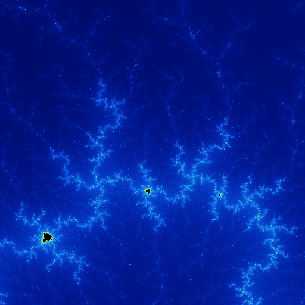

# MANDELBROT SET

## Compile
```
g++-7 --std=c++17 -O3 save_image.cpp utils.cpp main.cpp -lfreeimage -lsfml-graphics -lsfml-window -lsfml-system -lpthread
```

## Using
Change values in config.hpp to manipulate consts.
```
./a.out
```

## Some Mandelbrot set zooms




