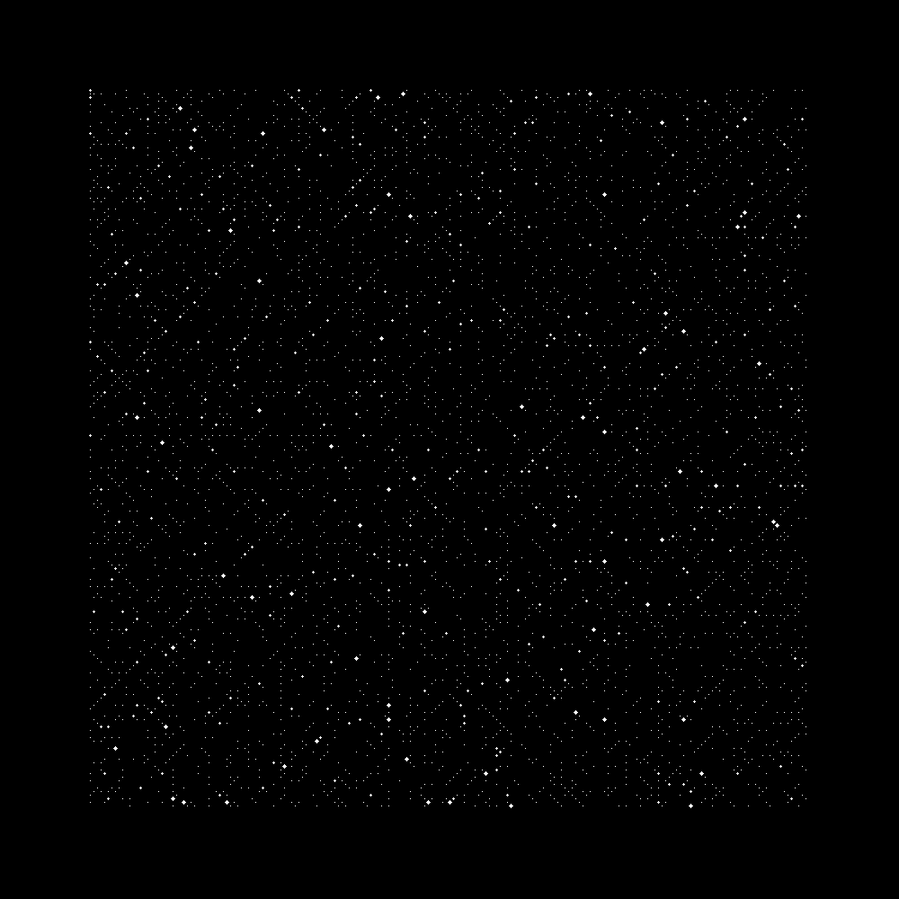

Ulam Spiral
===========

Size of dots is randomly determined. Result will be saved as *result.png*.

Build command
-------------

```bash
g++-7 -Wall -Wextra -Wpedantic -O3 --std=c++17 -o a.out main.cpp -lsfml-graphics -lsfml-window -lsfml-system
```

Sample result
-------------

