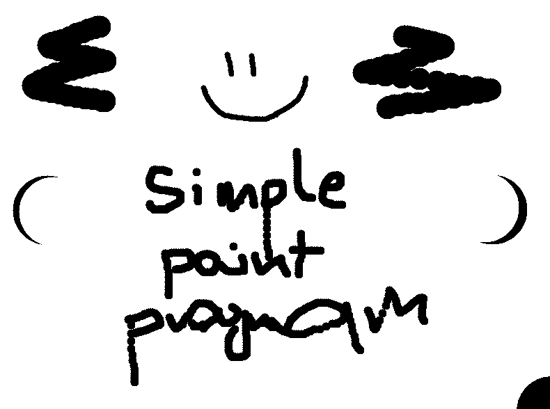

# Simple Paint Program

## About
Colors: Black (lmb), White (rmb)
Click 'Add' on numpad to increase size of brush or 'Substract' to decrease size of brush.
Escape to close app.

## Compile
```
g++-7 --std=c++17 main.cpp -o app.e -lsfml-graphics -lsfml-window -lsfml-system
```

## Photo
