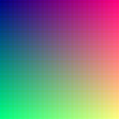

# STEGANOGRAPHY

Appliaction to encode and decode data in images.

## Building
```
g++-7 --std=c++17 main.cpp -o app.e -Wall -Wextra -Wpedantic -O3 -Wno-address -lsfml-grpahics -lsfml-window -lsfml-system
```

## Using
To encode:
```
./app.e --encode image.png data.txt output.png
```

To decode:
```
./app.e --encode image.png data.txt output.png
```

## Result
Image without encoded data on right and with encoded data on left.<br/>
